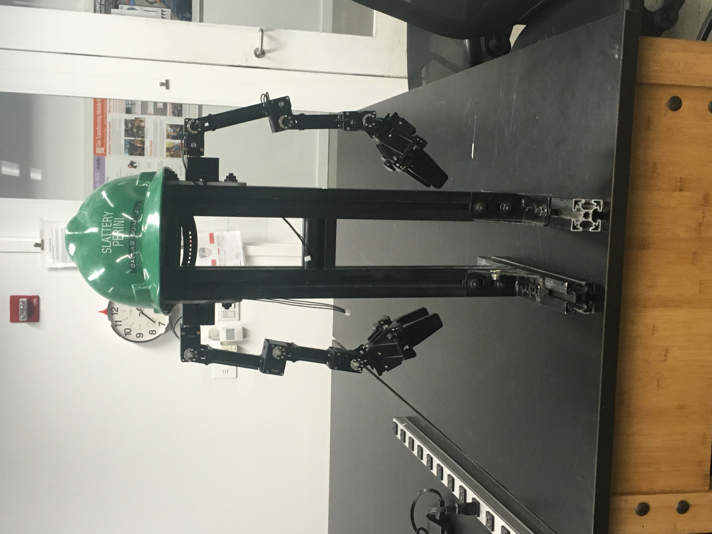

# MarvinARM

by Do Hyung (Dave) Kwon, Rose Gebhardt, Haoran (Harry) Wei, David Stekol, and Sohaib Bhatti

## Requirement
Make Sure you have these packages installed on Ubuntu 18.04. Otherwise follow the Installation Guide below. 
```
Ubuntu 18.04.5
Git
ROS Melodic
Azure Kinect SDK
Azure Kinect Body Tracking SDK
Azure Kinect ROS driver
Openmanipulator X
```
## Installation
Installing Ubuntu 18.04: you can follow this link: https://phoenixnap.com/kb/how-to-install-ubuntu-18-04. 
Installing Git on Ubuntu (Linux): Run `sudo apt install git-all` in terminal. 

Step by step (we assume you already have ubuntu 18.04 and Git installed).
ROS installation
```
sudo apt-get update && sudo apt-get upgrade
sudo apt install curl # if you haven't already installed curl
curl -s https://raw.githubusercontent.com/ros/rosdistro/master/ros.asc | sudo apt-key add -
wget https://raw.githubusercontent.com/ROBOTIS-GIT/robotis_tools/master/install_ros_melodic.sh && chmod 755 ./install_ros_melodic.sh && bash ./install_ros_melodic.sh
```
OpenManipulatorX packages
```
sudo apt-get install ros-kinetic-ros-controllers ros-kinetic-gazebo* ros-kinetic-moveit* ros-kinetic-industrial-core
```
Create a catkin workspace folder under a directory of your choice, we picked the linux user home folder (you can get always get there by typing `cd ~`).
```
mkdir -p ~/catkin_ws/{src,devel,build}
```
From here on, most code and packages for marvin exists in this workspace folder. Enter catkin workspace and download the following packages.   
```
cd ~/catkin_ws/src/
git clone https://github.com/ROBOTIS-GIT/DynamixelSDK.git
git clone https://github.com/ROBOTIS-GIT/dynamixel-workbench.git
git clone https://github.com/ROBOTIS-GIT/dynamixel-workbench-msgs.git
git clone https://github.com/ROBOTIS-GIT/open_manipulator.git
git clone https://github.com/ROBOTIS-GIT/open_manipulator_msgs.git
git clone https://github.com/ROBOTIS-GIT/open_manipulator_simulations.git
git clone https://github.com/ROBOTIS-GIT/robotis_manipulator.git
cd ~/catkin_ws 
catkin_make #If this doesn't work, restart the computer and try again
```
Azure Kinect SDK:
```
curl -sSL https://packages.microsoft.com/keys/microsoft.asc | sudo apt-key add -
sudo apt-add-repository https://packages.microsoft.com/ubuntu/18.04/prod

sudo apt-get update #If this throws an error with unsupported architecture,  open the file located at "/etc/apt/sources.list" in an editor, scroll down to where the Microsoft URL is located, and in between the "deb" and the start of the link insert "[arch=amd64]". Then rerun "sudo apt-get update" and it should work fine now.

sudo apt install k4a-tools=1.3.0
sudo apt install k4a1.3-dev
$catkin_make
```
Azure Kinect ROS Driver


This guide is only for native Linux OS, not Virtual Machines. While it may work on VMs, it is not guaranteed to do so.

For ROS installation, follow the guide at this link: https://emanual.robotis.com/docs/en/platform/openmanipulator_x/ros_setup/. There are two key caveats. The first is that all instances of "kinetic" must be replaced with "melodic", as that is the proper ROS version for Ubuntu 18.04. The second is that an error may occur where a key is not found and the installation stops. If this occurs, the following commands should be executed:
sudo apt install curl # if you haven't already installed curl
curl -s https://raw.githubusercontent.com/ros/rosdistro/master/ros.asc | sudo apt-key add -

Once these commands are executed, run again the "wget" command and ROS should install properly.

OpenMANIPULATOR packages: To install the needed packages for OpenMANIPULATOR just follow the instructions on the link above. In the event that the final line throws an error, cd into the directory and execute "catkin make" on separate lines, and failing that restart the computer and try it again.

Azure Kinect SDK: To install the SDK, follow the instructions at this link: https://docs.microsoft.com/en-us/azure/kinect-dk/sensor-sdk-download. You may encounter an error when setting up the Microsoft package repo where a configured file "main/binary-i386/Packages" will not be acquired as the microsoft repo does not support the i386 architecture. To fix this, open the file located at "/etc/apt/sources.list" in an editor, scroll down to where the Microsoft URL is located, and in between the "deb" and the start of the link insert "[arch=amd64]". Then rerun "sudo apt-get update" and it should work fine now.

After setting up the Microsoft repo, it's time to install the Azure SDK. However, we will not be executing the base command given in the tutorial as that command installs the newest version of libk4a, which is incompatible with the ROS driver. Instead run "sudo apt install k4a-tools=1.3.0". This version will work properly with the ROS driver. Then run "sudo apt install k4a1.3-dev" to install the developer version.

Now it is time to set up the Azure Kinect ROS Driver. Go to /catkin_ws/src and clone this github repo: https://github.com/microsoft/Azure_Kinect_ROS_Driver.git. Once it is fully cloned go back up to the catkin_ws folder and run catkin_make to build the repo. You may need to run "catkin_make --force-cmake" if that doesn't work.

cd ~/catkin_ws/src
git clone https://github.com/thedavekwon/MarvinARM.git
rosdep install --from-paths MarvinARM --ignore-src -r -y
cd ~/catkin_ws
catkin_make


### Install rosdep 
```
# ROS Noetic
sudo apt-get install python3-rosdep
# ROS Melodic and earlier
sudo apt-get install python-rosdep
```
## Usage
To run the physical robot. In two seperate terminal windows, type the following:
```
roslaunch azure_kinect_ros_driver driver.launch 
roslaunch mimic mimic.launch

# for launching gazebo
roslaunch azure_kinect_ros_driver driver.launch 
roslaunch mimic mimic_gazebo.launch
```
## Sources
1. [ROBOTIS-GIT/open_manipulator](https://github.com/ROBOTIS-GIT/open_manipulator)
2. [microsoft/Azure_Kinect_ROS_Driver](https://github.com/microsoft/Azure_Kinect_ROS_Driver)
3. [Azure KInect SDK (k4a) Documentation](https://github.com/microsoft/Azure-Kinect-Sensor-SDK)
